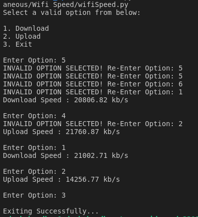

## Python script that provides the download and upload speed of your Wi-Fi
A simple Python script that uses 'speedtest' module to test the internet bandwidth of your connection.

### Prerequisites
You will need to install speedtest module. 

### How to run the script

- For Python 3: ```python3 wifi_speed.py```
- For Python 2: ```python wifi_speed.py```

### Screenshot/GIF showing the sample use of the script


### _Author Name_
Adesh Choudhar
