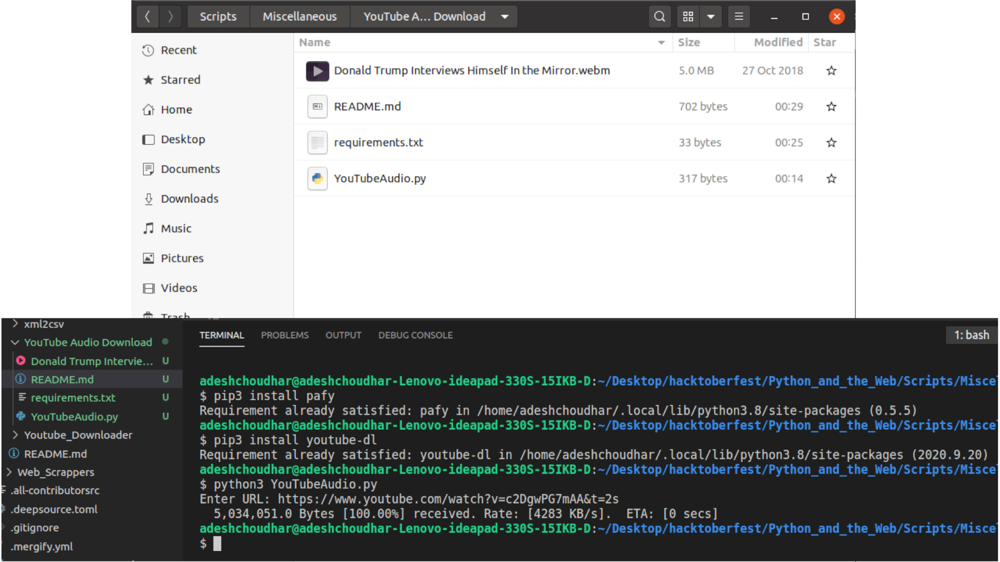

## Python script that downloads audio from YouTube video URLs
A simple Python script that uses 'pafy' library to download audio from YouTube URLs of that particular video.

### Prerequisites
You will need to install pafy library and also youtube-dl library too. You can use commands which are visible in screenshot.png.

### How to run the script

For Python 3: ```python3 youtube_audio_download.py```

### Screenshot/GIF showing the sample use of the script


### _Author Name_
Adesh Choudhar
